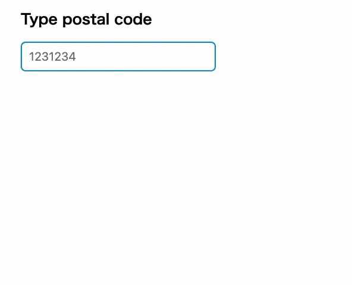

[](https://github.com/naotsugu/jpostal/actions/workflows/gradle-build.yml)

# jpostal

日本郵政が提供する郵便番号辞書（ken_all.csv）は、そのままでは郵便番号マスタファイルとして利用するのに適していません。

例えば、町域名の項目には「以下に掲載がない場合」や「白浜町の次に番地がくる場合」といった、マスタデータとしては不適切な記述が含まれています。

```csv
..,"6492200",..,"和歌山県","西牟婁郡白浜町","以下に掲載がない場合",0,0,0,0,0,0
..,"6492211",..,"和歌山県","西牟婁郡白浜町","白浜町の次に番地がくる場合",0,0,0,0,0,0
```

このような不適切な記載は多岐にわたり、郵便番号マスタとして利用するには複雑な加工処理が必要です。

<br/>

`jpostal` は、`ken_all.csv` に含まれる不適切な記載パターンを可能な限り整形し、郵便番号マスタとして活用できるようにするユーティリティライブラリです。

**【重要】** 2025年5月より、日本郵政から「郵便番号・デジタルアドレスAPI」が提供されています。郵便番号から住所をサジェストするようなケースでは、このAPIの利用を推奨します。`jpostal` は、オフライン環境での利用や、独自の加工ロジックを適用したい場合に特に有用です。



<br/>

## Features

*   日本郵政のWebサイトから辞書CSVを自動ダウンロード
*   以下の辞書データを選択可能:
    *   「住所の郵便番号（1レコード1行、UTF-8形式）」（`utf_all.csv`）
    *   「読み仮名データの促音・拗音を小書きで表記するもの」（`ken_all.zip`）
    *   「事業所の個別郵便番号」（`jigyosyo.zip`）
*   住所情報の高度な整形処理
*   辞書の自動アップデート機能（月次）
*   REST Webサーバー機能付属
*   整形済みCSVファイル出力機能
*   外部依存ライブラリなし

<br/>

## Usage

### ライブラリとして利用

以下の依存関係を追加します。

```kotlin
dependencies {
    implementation("com.mammb:jpostal:0.5.1")
}
```

`Postal` を生成して初期化します.

```java
Postal postal = Postal.of();
postal.initialize();
```

生成したインスタンスに郵便番号のクエリを渡すことで、候補の郵便番号と住所を取得できます。

```java
String code = "105001";
Collection<Address> addresses = postal.get(code);
// 取得例:
// [{"code": "1050011", "prefecture": "東京都", "city": "港区", "town": "芝公園", "street": ""},
//  {"code": "1050012", "prefecture": "東京都", "city": "港区", "town": "芝大門", "street": ""},
//  {"code": "1050013", "prefecture": "東京都", "city": "港区", "town": "浜松町", "street": ""},
//  {"code": "1050014", "prefecture": "東京都", "city": "港区", "town": "芝", "street": ""}]
```

<br/>

### CSVファイル出力

整形済みの郵便番号データをCSVファイルとして出力できます。

`-o` オプションで出力ファイル名を指定します。

```bash
$ java -jar jpostal-0.5.1.jar -o out.csv
```

出力されるCSVファイルのフォーマットは `郵便番号,地方公共団体コード,都道府県名,市区町村名,町域名` です。

<br/>

### REST Webサーバー

RESTサーバーとして利用する場合は、`jpostal.jar` を直接実行します。

プロジェクトをビルドして実行するか、`https://github.com/naotsugu/jpostal/releases` から `jpostal.jar` をダウンロードして実行してください。

```bash
# プロジェクトをクローンしてビルド・実行する場合
$ git clone https://github.com/naotsugu/jpostal.git
$ cd jpostal
$ ./gradlew jar
$ java -jar app/build/libs/jpostal-0.5.1.jar

# ダウンロードしたjarを実行する場合
$ java -jar jpostal-0.5.1.jar
```

Javaの最低バージョンはJDK 11です。ビルドにはJDK 21以下が必要です(Gradle のバージョン制約のため)。

`PostalServer` クラスを直接利用することも可能です。

```java
PostalServer server = PostalServer.of(postal);
server.start();
```

サーバー起動後、`http://localhost:8080/postal/105001` のようにアクセスすることでJSON形式で結果を取得できます。
また、`http://localhost:8080/postal/console.html` にアクセスすると、簡易的な住所チェック用コンソールが表示されます。

<br/>

## 設定オプション

`Postal` インスタンス生成時に以下のオプションを設定できます。

```java
Postal postal = Postal.of()
    .useLegacySource(false)
    .fineAddressSupport(true)
    .leftMatchSupport(true)
    .leftMatchLimitCount(20)
    .officeSourceSupport(false)
    .autoUpdateSupport(true);
```

| Option                | Default | 説明                                                                                                                            |
| :-------------------- | :------ | :------------------------------------------------------------------------------------------------------------------------------ |
| `useLegacySource`     | `false` | 2023年6月以降に提供開始された「1レコード1行、UTF-8形式ファイル」を使用するか、旧来形式ファイルを使用するかを指定します。`true` に設定すると旧来形式のファイルがソースとして使用されます。 |
| `fineAddressSupport`  | `true`  | 詳細な住所加工を行うかどうかを指定します。                                                                                    |
| `leftMatchSupport`    | `true`  | 郵便番号の前方一致検索を有効にするかどうかを指定します。                                                                        |
| `leftMatchLimitCount` | `20`    | 前方一致検索時の検索結果の最大件数を指定します。                                                                              |
| `officeSourceSupport` | `false` | 事業所の個別郵便番号データをサポートするかどうかを指定します。                                                                  |
| `autoUpdateSupport`   | `false` | 郵便番号辞書の自動更新を有効にするかどうかを指定します（デフォルトでは無効）。                                                  |

<br/>

## 詳細

### 辞書のダウンロード

`jpostal.jar` を実行するディレクトリ、または指定されたデータディレクトリに `ken_all.zip` または `utf_all.zip` が存在する場合、そのファイルが利用されます。

ファイルが存在しない場合は、日本郵政の辞書ファイルを自動でダウンロードします.
ダウンロードしたファイルは `jpostal.jar` 実行時のディレクトリにダウンロードされるため、次回起動時にはこのファイルを使うようになります.

ダウンロードするファイルは「住所の郵便番号（1レコード1行、UTF-8形式）（CSV形式）」です。
`useLegacySource` に `true` を指定した場合には「読み仮名データの促音・拗音を小書きで表記するもの」の全国版を使用します.

デフォルトでダウンロードされるファイルは「住所の郵便番号（1レコード1行、UTF-8形式）（CSV形式）」です。
`useLegacySource` を `true` に設定した場合は、「読み仮名データの促音・拗音を小書きで表記するもの」の全国版が使用されます。

`officeSourceSupport` オプションが有効化されている場合は、「事業所の個別郵便番号」（`jigyosyo.zip`）も合わせて扱われます。

### 辞書の取得元

辞書の取得元URLは、デフォルトで以下のように定義されています。
システムプロパティを定義することで、取得元URLを変更できます。

| 項目                    | デフォルトソースURL                                                                | システムプロパティ                                  |
| :---------------------- | :--------------------------------------------------------------------------------- | :-------------------------------------------------- |
| 住所の郵便番号            | `https://www.post.japanpost.jp/zipcode/dl/kogaki/zip/ken_all.zip`                  | `com.mammb.code.jpostal.source.standard.url`        |
| 住所の郵便番号(UTF形式)   | `https://www.post.japanpost.jp/zipcode/dl/utf/zip/utf_ken_all.zip`                 | `com.mammb.code.jpostal.source.standardUtf.url`     |
| 事業所の個別郵便番号      | `https://www.post.japanpost.jp/zipcode/dl/jigyosyo/zip/jigyosyo.zip`               | `com.mammb.code.jpostal.source.office.url`          |

### 辞書の更新

日本郵政の郵便番号データは月末に更新分が公開されます。

`autoUpdateSupport` オプションを `true` に設定することで、月初（0時〜1時の間のランダムな時刻）に辞書が自動更新されます。

### 郵便番号のマッチモード

*   `leftMatchSupport` を `true` に設定した場合、郵便番号を前方一致で検索します。
*   `leftMatchSupport` を `false` に設定した場合は、完全一致検索となります。

前方一致検索で取得する結果の最大件数は `leftMatchLimitCount` で指定します。

### 住所情報の整形

日本郵政が公開する郵便番号辞書は、システムでそのまま利用するには不適切なデータが含まれるため、`jpostal` では各種の整形処理を行っています。

複数行に分割されたレコードを合成した後、[`com.mammb.code.jpostal.source.TownEditor`](app/src/main/java/com/mammb/code/jpostal/source/TownEditor.java) にある変換処理が適用されます。

例えば、以下のようなレコードは、

```
"0580343",..,"北海道","幌泉郡えりも町","東洋（油駒、南東洋、１３２～１５６、１５８～３５４、３６６、３６７番地）"
```

`fineAddressSupport` オプションが `true` の場合、以下のような住所情報として整形されます。

```
"0580343",..,"北海道","幌泉郡えりも町","東洋","油駒"
"0580343",..,"北海道","幌泉郡えりも町","東洋","南東洋"
"0580343",..,"北海道","幌泉郡えりも町","東洋","３６６番地"
"0580343",..,"北海道","幌泉郡えりも町","東洋","３６７番地"
"0580343",..,"北海道","幌泉郡えりも町","東洋",""
```

`fineAddressSupport` オプションを `false` に設定した場合は、以下のように編集されます。

```
"0580343",..,"北海道","幌泉郡えりも町","東洋",""
```

なお、「事業所の個別郵便番号」については、住所情報の編集は行われません。
