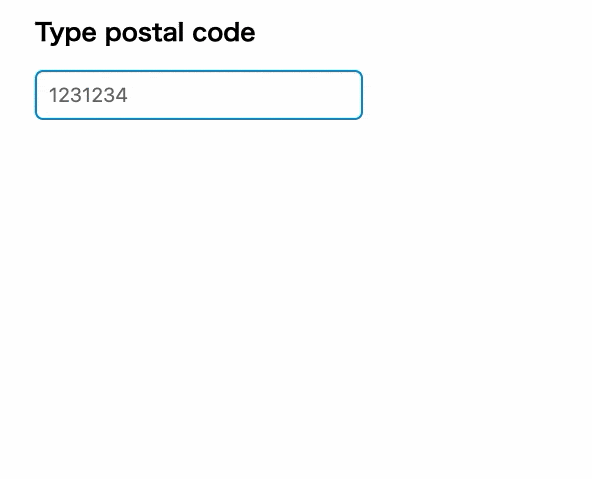

[](https://github.com/naotsugu/jpostal/actions/workflows/gradle-build.yml)

# jpostal

* Read this in other languages: [日本語](README.ja.md)



The postal code dictionary (ken_all.csv) provided by Japan Post is not suitable for use as a postal code master file as it is.

For example, the town name field contains descriptions that are inappropriate for master data, such as "以下に掲載がない場合" or "白浜町の次に番地がくる場合".

```csv
..,"6492200",..,"和歌山県","西牟婁郡白浜町","以下に掲載がない場合",0,0,0,0,0,0
..,"6492211",..,"和歌山県","西牟婁郡白浜町","白浜町の次に番地がくる場合",0,0,0,0,0,0
```

There are many other such inappropriate descriptions, and complex processing is required to use it as a postal code master.

<br/>

`jpostal` is a utility library that formats the inappropriate description patterns contained in `ken_all.csv` as much as possible to make it usable as a postal code master.

**[Important]** From May 2025, Japan Post will provide a "Postal Code/Digital Address API". For cases such as suggesting addresses from postal codes, it is recommended to use this API. `jpostal` is particularly useful for offline use or when you want to apply your own processing logic.


<br/>

## Features

*   Automatically download dictionary CSV from the Japan Post website
*   The following dictionary data can be selected:
    *   "Postal codes for addresses (1 record per line, UTF-8 format)" (`utf_all.csv`)
    *   "Kana data with small letters for geminate consonants and palatalized sounds" (`ken_all.zip`)
    *   "Individual postal codes for business establishments" (`jigyosyo.zip`)
*   Advanced formatting of address information
*   Automatic dictionary update function (monthly)
*   Includes a REST web server
*   Formatted CSV file output function
*   No external dependencies

<br/>

## Usage

### Use as a library

Add the following dependency to your `build.gradle.kts`.

```kotlin
dependencies {
    implementation("com.mammb:jpostal:0.5.1")
}
```

Create and initialize the `Postal` class.

```java
Postal postal = Postal.of();
postal.initialize();
```

You can get candidate postal codes and addresses by passing a postal code query to the created instance.

```java
String code = "105001";
Collection<Address> addresses = postal.get(code);
// Example of acquisition:
// [{"code": "1050011", "prefecture": "東京都", "city": "港区", "town": "芝公園", "street": ""},
//  {"code": "1050012", "prefecture": "東京都", "city": "港区", "town": "芝大門", "street": ""},
//  {"code": "1050013", "prefecture": "東京都", "city": "港区", "town": "浜松町", "street": ""},
//  {"code": "1050014", "prefecture": "東京都", "city": "港区", "town": "芝", "street": ""}]
```

<br/>

### CSV file output

You can output the formatted postal code data as a CSV file.

Specify the output file name with the `-o` option.

```bash
$ java -jar jpostal-0.5.1.jar -o out.csv
```

The format of the output CSV file is `Postal code,Local government code,Prefecture name,City name,Town name`.

<br/>

### REST Web Server (PostalServer)

To use it as a REST server, run `jpostal.jar` directly.

Build and run the project, or download and run `jpostal.jar` from `https://github.com/naotsugu/jpostal/releases`.

```bash
# When cloning, building, and running the project
$ git clone https://github.com/naotsugu/jpostal.git
$ cd jpostal
$ ./gradlew jar
$ java -jar app/build/libs/jpostal-0.5.1.jar

# When running the downloaded jar
$ java -jar jpostal-0.5.1.jar
```

The minimum Java version is JDK 11. JDK 21 or lower is required for building.

You can also use the `PostalServer` class directly.

```java
PostalServer server = PostalServer.of(postal);
server.start();
```

After starting the server, you can get the results in JSON format by accessing `http://localhost:8080/postal/105001`.
Also, a simple address check console is displayed by accessing `http://localhost:8080/postal/console.html`.

<br/>

## Options

You can set the following options when creating a `Postal` instance.

```java
Postal postal = Postal.of()
    .useLegacySource(false)
    .fineAddressSupport(true)
    .leftMatchSupport(true)
    .leftMatchLimitCount(20)
    .officeSourceSupport(false)
    .autoUpdateSupport(true);
```

| Option                | Default | Description                                                                                                                            |
| :-------------------- | :------ | :------------------------------------------------------------------------------------------------------------------------------------- |
| `useLegacySource`     | `false` | Specifies whether to use the "1 record per line, UTF-8 format file" provided since June 2023, or the conventional format file. If set to `true`, the conventional format file is used as the source. |
| `fineAddressSupport`  | `true`  | Specifies whether to perform detailed address processing.                                                                              |
| `leftMatchSupport`    | `true`  | Specifies whether to enable prefix search for postal codes.                                                                            |
| `leftMatchLimitCount` | `20`    | Specifies the maximum number of search results for a prefix search.                                                                    |
| `officeSourceSupport` | `false` | Specifies whether to support individual postal code data for business establishments.                                                  |
| `autoUpdateSupport`   | `false` | Specifies whether to enable automatic updating of the postal code dictionary (disabled by default).                                    |

<br/>

## Details

### Dictionary Download

If `ken_all.zip` or `utf_all.zip` exists in the directory where `jpostal.jar` is executed or in the specified data directory, that file will be used.

If the file does not exist, the dictionary file from Japan Post will be automatically downloaded. The downloaded file is saved in the execution directory and will be used from the next startup.

The file downloaded by default is "Postal codes for addresses (one record per line, UTF-8 format) (CSV format)".
If `useLegacySource` is set to `true`, the national version of "Kana data with small letters for geminate consonants and palatalized sounds" will be used.

If the `officeSourceSupport` option is enabled, "Individual postal codes for business establishments" (`jigyosyo.zip`) will also be handled.

### Dictionary Source

The dictionary source URLs are defined as follows by default.
You can change the source URLs by defining system properties.

| Item                            | Default Source URL                                                                | System Property                                     |
| :------------------------------ | :-------------------------------------------------------------------------------- | :-------------------------------------------------- |
| Postal codes for addresses      | `https://www.post.japanpost.jp/zipcode/dl/kogaki/zip/ken_all.zip`                   | `com.mammb.code.jpostal.source.standard.url`        |
| Postal codes for addresses (UTF) | `https://www.post.japanpost.jp/zipcode/dl/utf/zip/utf_ken_all.zip`                  | `com.mammb.code.jpostal.source.standardUtf.url`     |
| Individual postal codes for business establishments | `https://www.post.japanpost.jp/zipcode/dl/jigyosyo/zip/jigyosyo.zip`                | `com.mammb.code.jpostal.source.office.url`          |

### Dictionary Update

The updated postal code data from Japan Post is released at the end of the month.

By setting the `autoUpdateSupport` option to `true`, the dictionary will be automatically updated at the beginning of the month (at a random time between 0:00 and 1:00).

### Postal Code Match Mode

*   If `leftMatchSupport` is set to `true`, the postal code will be searched by prefix match.
*   If `leftMatchSupport` is set to `false`, it will be an exact match search.

The maximum number of results to be retrieved in a prefix search is specified by `leftMatchLimitCount`.

### Address Information Formatting

The postal code dictionary published by Japan Post contains data that is not suitable for direct use in a system, so `jpostal` performs various formatting processes.

After combining records divided into multiple lines, the conversion process in [`com.mammb.code.jpostal.source.TownEditor`](app/src/main/java/com/mammb/code/jpostal/source/TownEditor.java) is applied.

For example, a record like the following:

```
"0580343",..,"北海道","幌泉郡えりも町","東洋（油駒、南東洋、１３２～１５６、１５８～３５４、３６６、３６７番地）"
```

If the `fineAddressSupport` option is `true`, it will be formatted as the following address information.

```
"0580343",..,"北海道","幌泉郡えりも町","東洋","油駒"
"0580343",..,"北海道","幌泉郡えりも町","東洋","南東洋"
"0580343",..,"北海道","幌泉郡えりも町","東洋","３６６番地"
"0580343",..,"北海道","幌泉郡えりも町","東洋","３６７番地"
"0580343",..,"北海道","幌泉郡えりも町","東洋",""
```

If the `fineAddressSupport` option is set to `false`, it will be edited as follows.

```
"0580343",..,"北海道","幌泉郡えりも町","東洋",""
```

Note that address information is not edited for "Individual postal codes for business establishments (事業所の個別郵便番号)".
